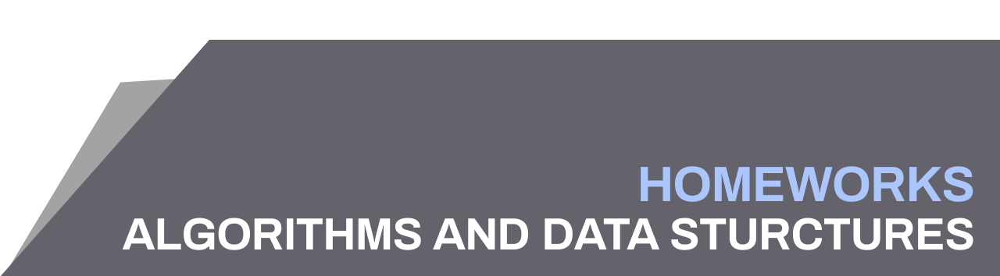

This repository includes **only** my solutions for tasks given as homeworks on "Algorithms and data structures".

Algorithms from laboratories and lectures are written by the lecturer - I personally think that they need more explaination and translation to human-readable language. Due to that reason they will be placed on the [c-sharp-algorithms](https://github.com/BordowyRydwan/c-sharp-algortihms) repository with satisfying explaination.

Solutions are written with Microsoft Visual Studio 2017 environment. You can simply create the new project, clone the repo and attach these folders to the project in the "Project options" menu.

Good luck!

## Currently done:
* Chapter 1
* Chapter 2
* Chapter 3
* Chapter 4
* Chapter 5
* Chapter 6
* Chapter 7
